

  

 <h1 align="center">CUET Virtual Classroom</h2>
 
CUET Virtual Classroom is an online web application made as the Lab project for CSE 300: Software Development Project.

  

    
    
    
    
     
  <h3 align="center">Built With</h3>
  <h4 align="center">Frameworks and Dependencies</h4>
  

  
    
    </a>
    
    

    

## Team Members:
* Adiba Sultana- 1804046
* Nafis Fuad Pranta- 1804053
* Ashfaqur Rahman Adib- 1804055
* Tahlil Abrar- 1804056
* Zerin Shaima Meem- 1804057

# Features
- [Signin](#signin)
- [Dashboard](#dashboard)
- [Notifications](#notifications)
- [Sidebar](#sidebar)
- [Calendar](#calendar)
- [Profile](#profile)
- [Edit Profile](#edit-profile)
- [Create Course](#create-course)
- [Publish Result](#publish-result)
- [Attendance](#attendance])
- [Display Result](#display-result)
- [Join Class](#join-class)
- [Class List](#class-list)
- [View Inside Classroom](#view-classroom)
- [Upload Post](#upload-post)
- [Comment](#comment)

## Signin
Students and teachers can login to an already existing account.If they forget their password, a reset password link will be sent to their email.

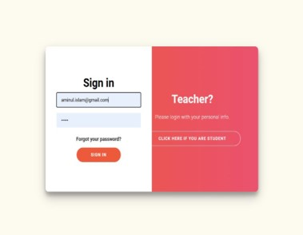     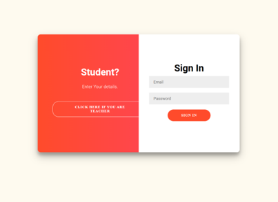

## Dashboard
The interface of dashboard is similar for both students and teachers consisting of different classes for respective students and teachers.
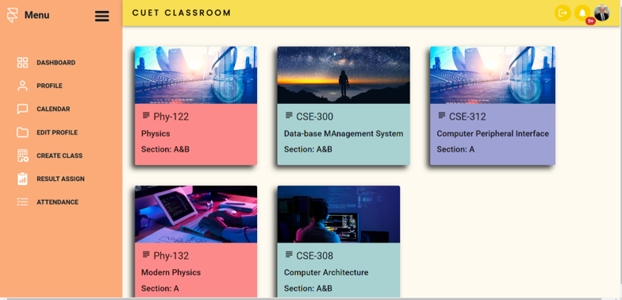

## Notifications
Teachers posting assignments or setting quiz time will be notified to the students who have joined to that particular class by using class code.

## Sidebar
Sidebar for both students and teachers is quite similar except the fact that teachers can enable himself to create new classes and assign results of exams of a particular class to students who have joined in that class. And students can view the published results of different courses.

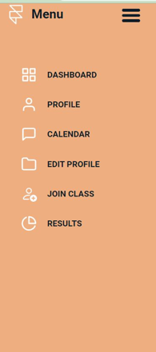    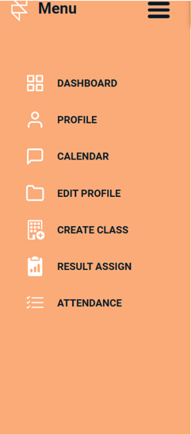

## Calendar
This is a calendar routine for the students so that each and every student from different levels and terms can enable himself to observe different classes that is going to occur through out the semester and plan accordingly(13 weeks) 

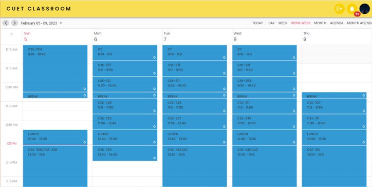

## Profile
Stuedents view consist of information relating to contact number,address,ID,email etc. whereas a teacher view consist of his/her name,designation and link to his/her online presence as well

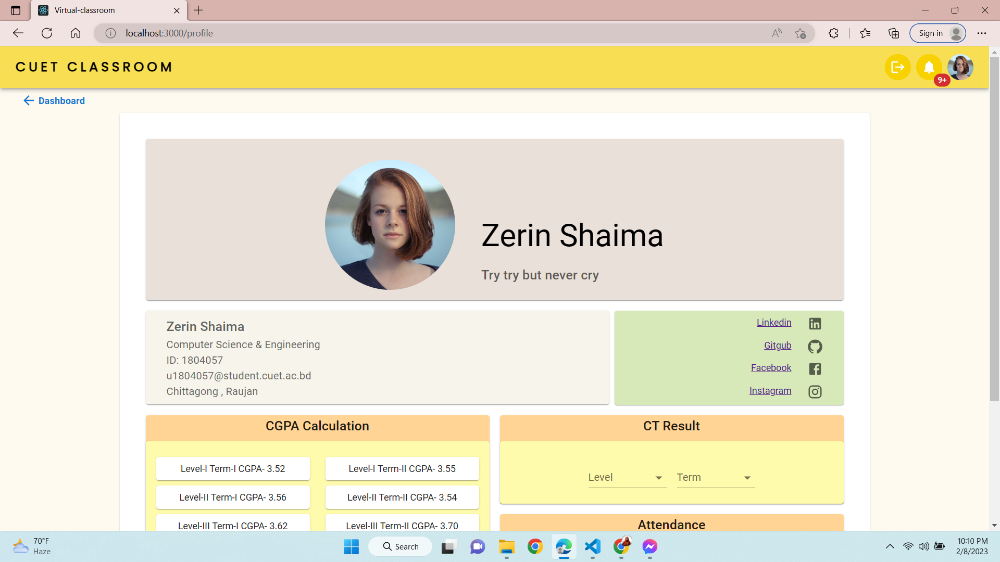  

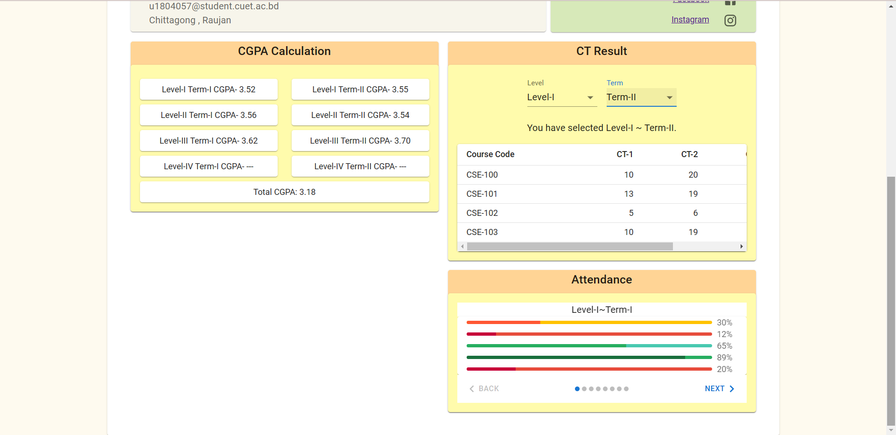

## Edit Profile
Both teacher and students have access to change their set data on their profile.
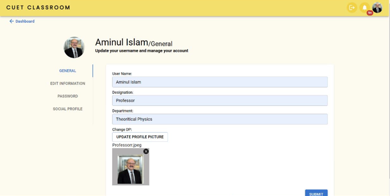

## Create Course
Only teacher account has access to this particular feature.Student account can't open new class for any course.
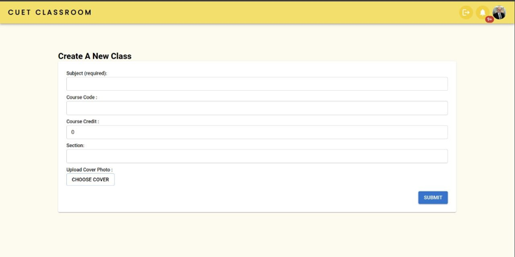

## Publish Result
Only teacher account has access to this particular feature.Any teacher can publish the CT marks and grade to all students who have joined in that class.

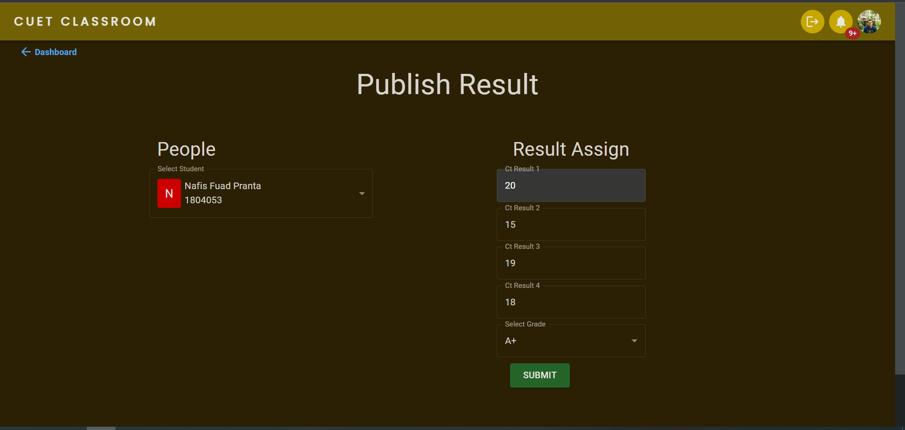

## Attendance
Teacher can take attendance of students who are present.
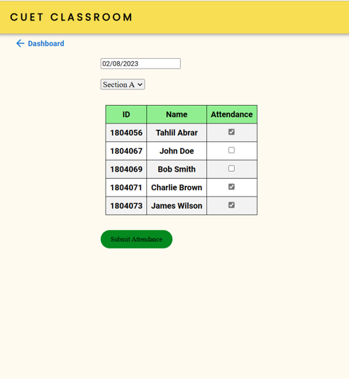

## Display Result
Users can create a new account by registering with an email.
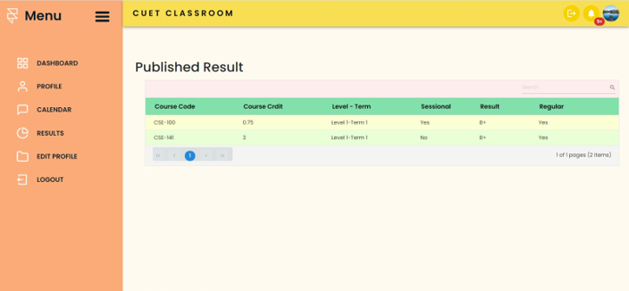

## Join Class
Users can create a new account by registering with an email.
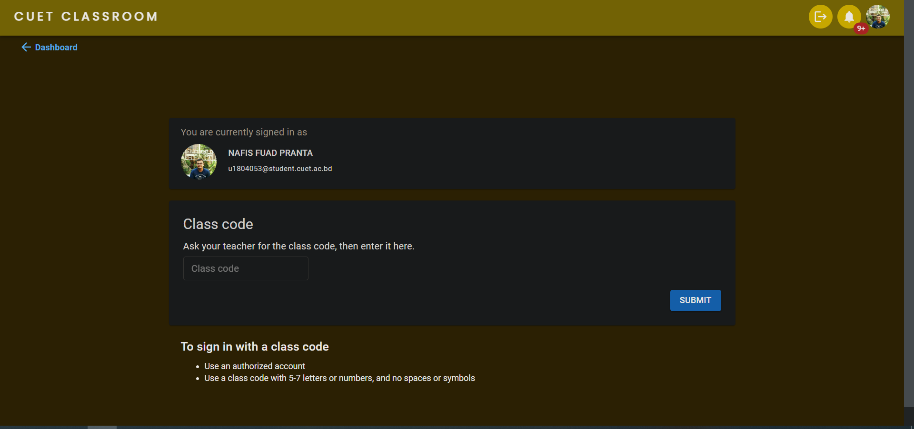

## Class List
Users can create a new account by registering with an email.

## View Inside Classroom
Users can create a new account by registering with an email.
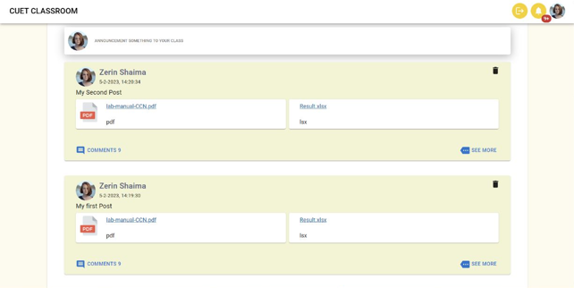

## Upload Post
Users can create a new account by registering with an email.
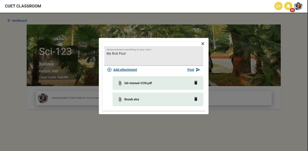

## Comment
Users can create a new account by registering with an email.
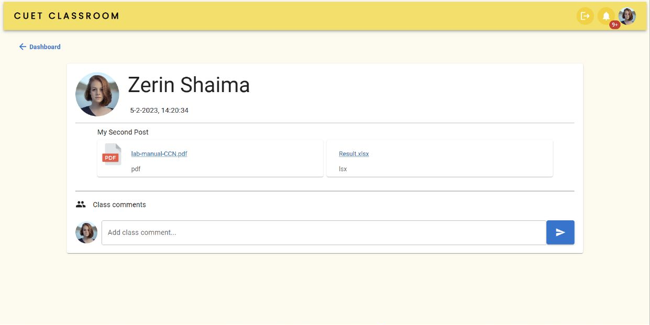

## Resources:
### Tutorials:
* [Basic React Tutorial by Learn with Sumit-LWS-Bangladesh](https://www.youtube.com/watch?v=5Xy-t8k_M4A&list=PLHiZ4m8vCp9M6HVQv7a36cp8LKzyHIePr)
* [Basic Django Tutorial by Corey Schafer](https://www.youtube.com/playlist?list=PL-osiE80TeTtoQCKZ03TU5fNfx2UY6U4p)
* [Firebase Tutorial by freeCodeCamp.org](https://www.youtube.com/watch?v=fgdpvwEWJ9M)
